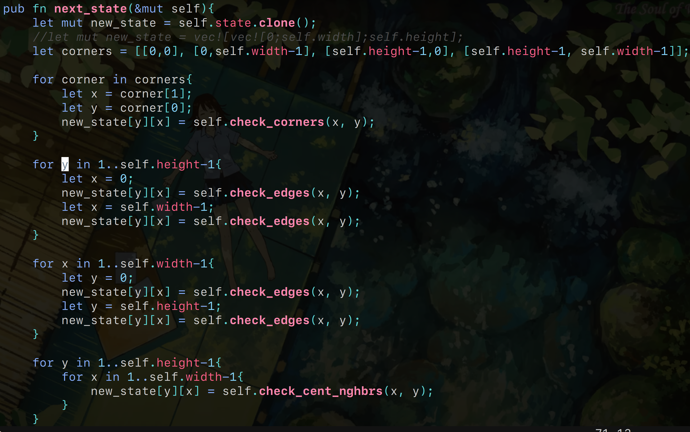

# Conway's Game of Life
Game of life implemented in rust
(improved version of my [previous attempt](https://github.com/k1ut3h/gameoflife-rust))

- I calculate the next state for central elements, corners and edges separately

---
this is it as of now
